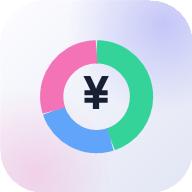

# ZANKIN（ザンキン）

**「次の給料日まで、あといくら使える？」を即答する家計アプリ**

🔗 **デモ: （公開後にURLを記載）**

## これは何？

ZANKIN は、細かい家計簿づけが続かない人のための「残金特化」アプリです。

一般的な家計簿アプリ（収支の網羅的な記録・分析）とは違い、**「突発の飲み会、行って大丈夫？」にその場で答えられること**だけに絞っています。ターゲットは大学生・若手社会人。

## 特徴

- 💸 **給料日区切りの残高管理** — カレンダー月ではなく「給料日から次の給料日まで」で計算。バイト代や仕送りの日でもOK
- 🍻 **出費シミュレーター** — 金額を入れると「使った後の残り」と「1日あたり使える額」を即表示
- 💳 **支払い方法別の残高** — 現金・QR決済・カードを別々の財布として管理（ゲージ＋円グラフ）
- 🧮 **電卓式入力** — 四則演算対応。割り勘・立て替えの記録もワンタップ
- 🔁 **予算の自動引き継ぎ** — 給料日が来ると前回の予算で新しい期間が始まる
- 🎨 **グラスモーフィズムUI** — ライト／ダークテーマ切替、残高はメーター風のカウントアニメーション
- 🌐 **多言語・多通貨** — 日本語／English、16通貨対応
- 📱 **PWA対応** — ホーム画面に追加すればネイティブアプリのように全画面で起動、オフラインでも動作
- 🔒 **完全ローカル** — データはすべて端末内の localStorage に保存。サーバーには何も送信しません

## 技術構成

- **単一HTMLファイル**（HTML / CSS / JavaScript すべてインライン、フレームワーク・ビルドツール不使用）
- Service Worker によるオフラインキャッシュ
- conic-gradient による円グラフ、backdrop-filter によるすりガラス表現
- 全文言を辞書管理する自前の i18n 機構

## 使い方

1. ブラウザで開くと初期設定（名前→給料日→予算）が始まります
2. ホームで「あといくら使えるか」を確認
3. お金を使ったら「記録」タブの電卓で入力
4. スマホなら「ホーム画面に追加」でアプリとして使えます

---

# ZANKIN

**A budget app that instantly answers: "How much can I spend until next payday?"**

Unlike full-featured expense trackers, ZANKIN focuses on one thing: telling you instantly whether you can afford that spontaneous night out. Pay-period based budgeting (payday to payday), per-method balances (cash / QR / card), a spending simulator, bilingual (JA/EN), 16 currencies, PWA-ready, and 100% local — no server, no account.

Built with a single HTML file. No frameworks, no build tools.
